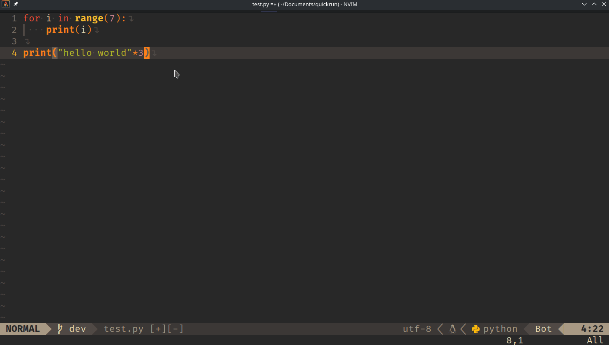

# QuickRun Neovim Plugin

Supercharge your Neovim experience with QuickRun, a versatile plugin designed for efficient code execution in visual mode. Save time on debugging and testing with a seamless integration that currently supports Python, Lua, JavaScript, and TypeScript. Expect more languages to join the party in future updates!

## Demo



## Features

- **Visual Mode Awesomeness**: Select your code, hit a keystroke, and watch the magic happen.
- **Language Support**: Current support for Python, Lua, JavaScript, and TypeScript.
- **Packer Integration**: Effortless installation using Packer. Keep your setup clean and organized.

## Installation

### Packer

Add the following to your Neovim configuration file:

```lua
use {
  'axtinm/quickrun',
  config = function()
    require('quickrun').setup()
  end
}
```

## Usage

1. In visual mode, select the code you want to execute.
2. Press the designated key (<leader>r | <leader>R).
3. Watch QuickRun do its thing!

## Future Roadmap

- **Expanded Language Support**: More languages will be added based on user demand.
- **Advanced Error Handling**: Enhance your debugging experience with robust error handling features.
- **User-Driven Improvements**: Open to suggestions and contributions! Share your ideas and let's make QuickRun even better.

## Contribution

Feel free to fork this repository, contribute improvements, or report issues. Your feedback is invaluable in making QuickRun the go-to tool for Neovim enthusiasts.
